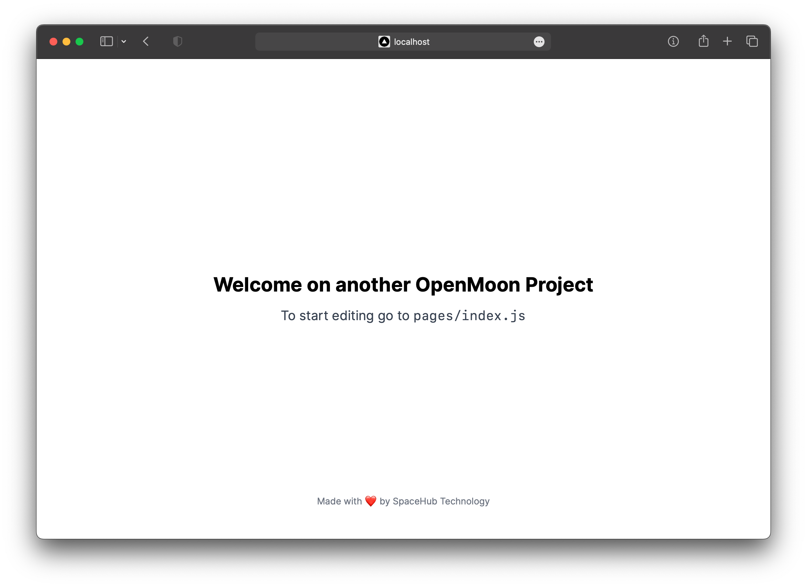

# NextGen Netlify



   

NextGen Netlify is a project created with [Next.js](https://nextjs.org/) and hosted on [Netlify](https://www.netlify.com/). This project was developed with the goal of providing a performant and responsive website using the latest web technologies.

## Features

- Server-Side rendering with Next.js for responsive pages and optimal loading speed.
- Continuous deployment to Netlify for a smooth development and deployment experience.
- Custom styling with Tailwind CSS for modern and flexible design.
- Add other relevant features to your project.

## How to get started

1. Clone this repository:

```bash
git clone https://github.com/tuo_nome_utente/nextgen-netlify.git
cd nextgen-netlify
```

2. Install dependencies:

```bash
npm install
```

3. Start the development server:

```bash
npm run dev
# or
yarn dev
```

4. The project should now be visible at [http://localhost:3000](http://localhost:3000).

## Deployment

This project is already configured for deployment to Netlify. Just push the repository to GitHub and Netlify will automatically start the deployment process. Be sure to set the environment variables and build settings correctly within your Netlify account.

[](https://app.netlify.com/start/deploy?repository=https://github.com/openmooncommunity/NextGen-Netlify&utm_source=github)

## Contribute

Pull requests are welcome. For significant changes, we recommend that you first open an issue to discuss the proposed changes.

## License

This project is licensed under the MIT license.
